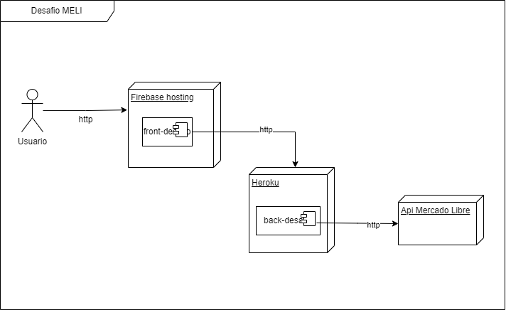
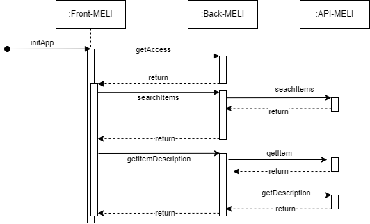
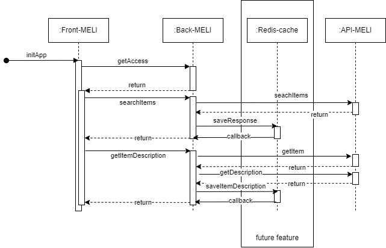

# Front Desafio MELI

<p>Proyecto para la postulación como Desarrollador FullStack para Mercado Libre Chile</p><br/>
<p>Este proyecto fue generado en NestJS</p>

### **Funciones principales**
  1. Api de busqueda con listado de Items
  2. Api que entrega el detalle de un item seleccionado
  3. Api de acceso para dar seguridad al consumo de los endpoints

---

## Tabla de contenido

>[Descripcion](#descripcion)

>[Stack tecnologico](#stack-tecnologico)

>[Instalacion Local](#instalacion-local)

>[Problemas conocidos](#problemas-conocidos)

>[Contacto](#contacto)

---

## Descripcion

<p>
Este proyecto sirve como metodo de medicion de conocimientos para ingresar a como desarrollador FullStack en Mercado Libre Chile. Fue realizado bajo la arquitectura modular del Framework NestJS.
</p>

### Modelo Alto nivel



### Diagrama de secuencia



#### Diagrama de secuencia futura integracion Redis-cache




---

## Stack tecnologico

_Principales tecnologias usadas en el proyecto_

- **Node** version 18.16.0
- **npm** version 9.5.1
- **NestJS** version 9.0.0

---

## Instalacion Local

### Installation

```bash
$ npm install
```

### Running the app

```bash
# development
$ npm run start

# watch mode
$ npm run start:dev

# production mode
$ npm run start:prod
```

### Test

```bash
# unit tests
$ npm run test

# e2e tests
$ npm run test:e2e

# test coverage
$ npm run test:cov
```

---

## Problemas conocidos

Para ver la siguiente informacion ingresar [aqui](./docs/TROUBLESHOOTING.md)

